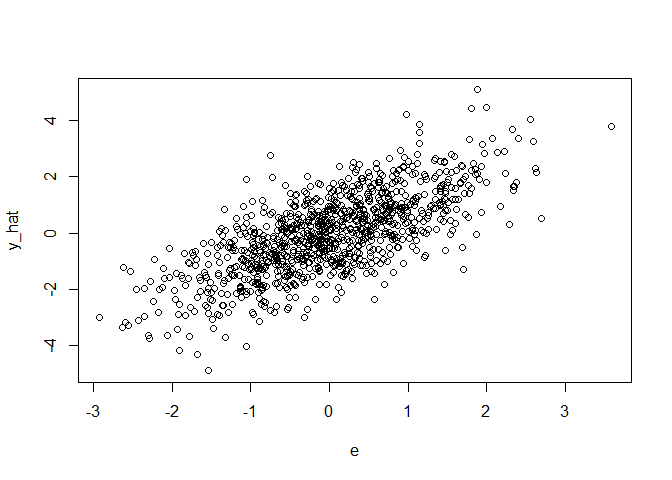
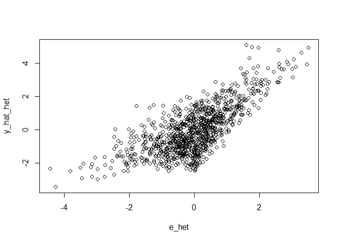
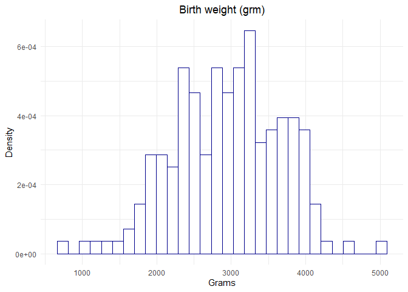
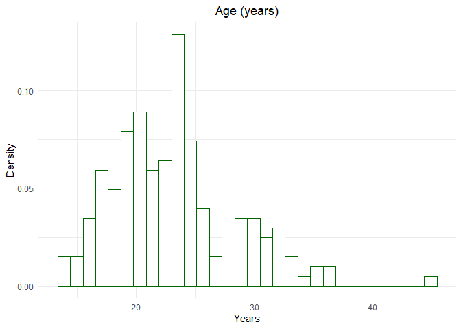
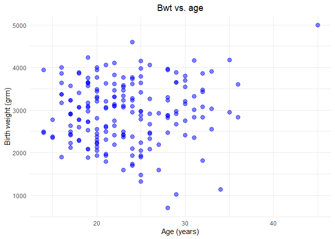
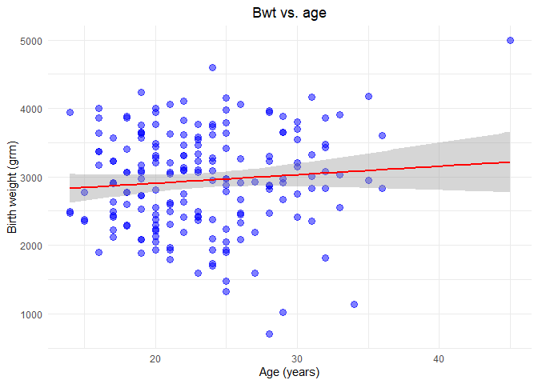

Session 2: Recap Regression Analysis
================
Laura Eberlein, Santiago Gómez-Echeverry & Dimitris Pavlopoulos
2022-11-21

- <a href="#setting-up" id="toc-setting-up">Setting up</a>
- <a href="#regression-modeling" id="toc-regression-modeling">Regression
  Modeling</a>
  - <a href="#assumptions" id="toc-assumptions">Assumptions</a>
    - <a href="#1---errors-are-independent-and-identically-distributed-iid"
      id="toc-1---errors-are-independent-and-identically-distributed-iid">1 -
      Errors are independent and identically distributed (i.i.d.)</a>
    - <a href="#2---exogeneity---evarepsilon_ix_i0"
      id="toc-2---exogeneity---evarepsilon_ix_i0">2 - Exogeneity - <span
      class="math inline"><em>E</em>(<em>ε</em><sub><em>i</em></sub>|<em>x</em><sub><em>i</em></sub>) = 0</span></a>
    - <a href="#3---absence-of-influential-outliers"
      id="toc-3---absence-of-influential-outliers">3 - Absence of influential
      outliers</a>
    - <a href="#4---lack-of-perfect-multicollinearity"
      id="toc-4---lack-of-perfect-multicollinearity">4 - Lack of perfect
      multicollinearity</a>
    - <a href="#5---homoscedasticity" id="toc-5---homoscedasticity">5 -
      Homoscedasticity</a>
- <a href="#example---birth-weight"
  id="toc-example---birth-weight">Example - Birth weight</a>
  - <a href="#simple-regression---continuous-iv"
    id="toc-simple-regression---continuous-iv">Simple regression -
    Continuous IV</a>
  - <a href="#simple-regression---dummy-iv"
    id="toc-simple-regression---dummy-iv">Simple regression - Dummy IV</a>
  - <a href="#multiple-regression---categorical-iv-factors-in-r"
    id="toc-multiple-regression---categorical-iv-factors-in-r">‘Multiple’
    regression - Categorical IV (factors in R)</a>
  - <a href="#multiple-regression" id="toc-multiple-regression">Multiple
    regression</a>
  - <a href="#checking-the-assumptions"
    id="toc-checking-the-assumptions">Checking the assumptions</a>
    - <a href="#1---normality-of-the-residuals"
      id="toc-1---normality-of-the-residuals">1 - Normality of the
      residuals.</a>
    - <a href="#3---absence-of-influential-outliers-1"
      id="toc-3---absence-of-influential-outliers-1">3 - Absence of
      influential outliers</a>
    - <a href="#4--multicollinearity" id="toc-4--multicollinearity">4
      -Multicollinearity</a>
    - <a href="#5---homoscedasticity-1" id="toc-5---homoscedasticity-1">5 -
      Homoscedasticity</a>

# Setting up

The idea of this practical is to go through the basics of multiple
regression analysis, which you should know from previous courses.

Before diving into the core of the lecture, remember that you should
always start your R session by arranging the work space.

``` r
# Clean the environment 
rm(list = ls())

# Setting the working directory
setwd("C:/Users/Startklar/OneDrive - Vrije Universiteit Amsterdam/Measurement Models in Quantitative Research/3 - Practicals/Meas_Models")

# Installing  and loading the required packages
library(ggplot2)
library(car)
library(lsr)
library(skedastic)
library(MASS)
```

# Regression Modeling

Now, we can go back to our topic. The main idea behind regression is
that a dependent variable (DV) can be modeled as a combination of a
single or multiple independent variables (IV). For example, we could
model a variable $y_{i}$ as the weighted sum of $k$ independent
variables, denoted by $x_{i}$, and an error term $\varepsilon_{i}$. Note
that in this notation $i$ refers to an individual. Thus, we have a
population model of the form:

$$
  y_{i} = \beta_{0} + \beta_{1}x_{1i}+...+\beta_{k}x_{ki} + \varepsilon_{i}
$$

Keep in mind that this model is the basis of many other and that
frequently, in all of them, we use greek letters to refer to parameters
and latin letters to refer to variables. Based on this model, which we
assume shows the real behavior of the variables in the population, we
estimate the unknown parameters and with them obtain the expected value
of $y_{i}$.The expected value of $y_{i}$,also referred as the estimated
model, is termed as:

$$
  E[y_{i}|x_{1i}...x_{ki}] = \hat{\beta_{0}}+ \hat{\beta}_{1}x_{1i}+...+\hat{\beta}_{k}x_{ki}
$$

But, wait, we didn’t really talk about how we obtain the estimates of
the parameters. Although there are several ways of doing this, the most
frequently used is to perform Ordinary Least Squares (OLS). The OLS
estimators are obtained by minimizing the sum of the square of the
residuals (the estimated errors).

$$
  Min \sum_{i=i}^{n}\hat{\varepsilon}_{i}^{2} = \sum_{i=i}^{n}(y_{i} - E[y_{i}|x_{1i}...x_{ki}])^{2}
$$

Standard statistical modeling takes a closer inspection on the
parameters since they give us information on the relationships between
the variables. On the other hand, machine learning approaches focus on
the expected value of the variable of interest since the objective there
is to predict the value of a determined variable

## Assumptions

### 1 - Errors are independent and identically distributed (i.i.d.)

When we say independent we imply that the values of

### 2 - Exogeneity - $E(\varepsilon_{i}|x_{i})=0$

This is equivalent to saying $Cov(\varepsilon_{i}, x_{i}) = 0$, which
implies that there is no part of the error that correlates with the
explanatory variables. There are several issues that can make this
assumption not feasible:

- Omitted Variable
- Reverse Causality
- Measurement Error
- Selection Bias

Keep in mind that this assumptions must hold for us to be able to say
that the we are observing a *causal* effect of $x_{i}$ on $y_{i}$. Thus,
achieving this is the focus of fields as impact evaluation.

### 3 - Absence of influential outliers

As you saw in the equations at the beginning of this lesson, regression
analysis is built on the concept of average (that’s why we used the
$E[y_{i}|.]$).

### 4 - Lack of perfect multicollinearity

### 5 - Homoscedasticity

Also know as homogeneity of variance, this assumption entails that the
variance of the errors is constant across the IV’s. In other words, if
we plot the residuals against our independent variables, and check two
different points of the IV, the variance of the residuals shall be
equivalent. This sounds a bit convoluted but maybe a plot might help to
see the distinction between homoscedasticity and heteroscedasticity.

``` r
set.seed(42)

# Homoscedasticity
n <- 1000
a <- 0; b <- 1
x <- rnorm(n, mean = 0, sd = 1)
e <- rnorm(n, mean = 0, sd = 1)
y_hat <- a + b*x + e
plot(e, y_hat)
```

<!-- -->

``` r
# Heteroscedasticity
n <- 1000
a <- 0; b <- 1
e_het <- rnorm(n, mean = 0, sd = (1+0.4*x))
```

    ## Warning in rnorm(n, mean = 0, sd = (1 + 0.4 * x)): NAs produced

``` r
y_hat_het <- a + b*x + e_het
plot(e_het, y_hat_het)
```

<!-- -->

# Example - Birth weight

``` r
data(birthwt, package = "MASS")

# Let's check what this data has
head(birthwt)
```

    ##    low age lwt race smoke ptl ht ui ftv  bwt
    ## 85   0  19 182    2     0   0  0  1   0 2523
    ## 86   0  33 155    3     0   0  0  0   3 2551
    ## 87   0  20 105    1     1   0  0  0   1 2557
    ## 88   0  21 108    1     1   0  0  1   2 2594
    ## 89   0  18 107    1     1   0  0  1   0 2600
    ## 91   0  21 124    3     0   0  0  0   0 2622

``` r
?birthwt
```

## Simple regression - Continuous IV

Our goal with this data will be to estimate children weight at birth. To
do so, we can first just employ age as an IV and see our results.
Beforehand though, let us see a scatter with these two variables

``` r
# Individual variables
ggplot(data = birthwt, aes(bwt)) +                  
  geom_histogram(aes(y = after_stat(density)), color = "darkblue", fill = "white") +
  theme_minimal() +
  labs(title = "Birth weight (grm)", y = "Density", x = "Grams") +
  theme(plot.title = element_text(hjust = 0.5))
```

<!-- -->

``` r
ggplot(data = birthwt, aes(age)) +                  
  geom_histogram(aes(y = after_stat(density)), color = "darkgreen", fill = "white") +
  theme_minimal() +
  labs(title = "Age (years)", y = "Density", x = "Years") +
  theme(plot.title = element_text(hjust = 0.5))
```

<!-- -->

``` r
# Scatter plot
ggplot(data = birthwt) +
  geom_point(aes(y = bwt, x = age), color = "blue", size = 3, alpha = 0.5) +
  theme_minimal() +
  labs(title = "Bwt vs. age", y = "Birth weight (grm)", x = "Age (years)") +
  theme(plot.title = element_text(hjust = 0.5))
```

<!-- -->

``` r
# Perform the regression
reg1 <- lm(bwt ~ age, data = birthwt) # lm stands for linear model
#reg1_alt <- glm(bwt ~ age, data = birthwt, family = "gaussian") # glm stands for generalized linear model

# Check the results
summary(reg1)
```

    ## 
    ## Call:
    ## lm(formula = bwt ~ age, data = birthwt)
    ## 
    ## Residuals:
    ##      Min       1Q   Median       3Q      Max 
    ## -2294.78  -517.63    10.51   530.80  1774.92 
    ## 
    ## Coefficients:
    ##             Estimate Std. Error t value Pr(>|t|)    
    ## (Intercept)  2655.74     238.86   11.12   <2e-16 ***
    ## age            12.43      10.02    1.24    0.216    
    ## ---
    ## Signif. codes:  0 '***' 0.001 '**' 0.01 '*' 0.05 '.' 0.1 ' ' 1
    ## 
    ## Residual standard error: 728.2 on 187 degrees of freedom
    ## Multiple R-squared:  0.008157,   Adjusted R-squared:  0.002853 
    ## F-statistic: 1.538 on 1 and 187 DF,  p-value: 0.2165

``` r
#summary(reg1_alt)
```

The results include:

*Residuals distribution*

*Information on coefficients*

*Residual standard error*

*F-statistic*

*Adjusted R-squared*

Now, to end with this part, let us see the scatter plot again but now
including our linear estimate.

``` r
plot1 <- ggplot(data = birthwt, aes(y = bwt, x = age)) +
  geom_point(color = "blue", size = 3, alpha = 0.5) +
  stat_smooth(method = "lm", col = "red") +
  theme_minimal() +
  labs(title = "Bwt vs. age", y = "Birth weight (grm)", x = "Age (years)") +
  theme(plot.title = element_text(hjust = 0.5))
plot1
```

<!-- -->

## Simple regression - Dummy IV

The interpretation of the regression results vary considerably when we
are dealing with IV’s that are dummies. We can see this by regressing
the birth weight against the dummy variable that indicates whether the
mother smoked (0 = Didn’t Smoke, 1 = Smoked).You’ll frequently encounter
dummy variables since they are a common way of representing the
presence/absence of a trait. Still, for including this variables in a
regression analysis you must be sure that it is coded as 0 and 1; a
common coding for these variables in surveys is 1 and 2 so you might
have to recode it.

``` r
# Perform the regression
reg2 <- lm(bwt ~ smoke, data = birthwt)

# Check the results
summary(reg2)
```

    ## 
    ## Call:
    ## lm(formula = bwt ~ smoke, data = birthwt)
    ## 
    ## Residuals:
    ##     Min      1Q  Median      3Q     Max 
    ## -2062.9  -475.9    34.3   545.1  1934.3 
    ## 
    ## Coefficients:
    ##             Estimate Std. Error t value Pr(>|t|)    
    ## (Intercept)  3055.70      66.93  45.653  < 2e-16 ***
    ## smoke        -283.78     106.97  -2.653  0.00867 ** 
    ## ---
    ## Signif. codes:  0 '***' 0.001 '**' 0.01 '*' 0.05 '.' 0.1 ' ' 1
    ## 
    ## Residual standard error: 717.8 on 187 degrees of freedom
    ## Multiple R-squared:  0.03627,    Adjusted R-squared:  0.03112 
    ## F-statistic: 7.038 on 1 and 187 DF,  p-value: 0.008667

``` r
# Perform the ANOVA
aov1 <- aov(bwt ~ smoke, data = birthwt)

# Check the results
summary(aov1)
```

    ##              Df   Sum Sq Mean Sq F value  Pr(>F)   
    ## smoke         1  3625946 3625946   7.038 0.00867 **
    ## Residuals   187 96343710  515207                   
    ## ---
    ## Signif. codes:  0 '***' 0.001 '**' 0.01 '*' 0.05 '.' 0.1 ' ' 1

``` r
# However, in ANOVA, there is a strong culture on presenting effect sizes by measures as eta
etaSquared(aov1)
```

    ##           eta.sq eta.sq.part
    ## smoke 0.03627047  0.03627047

The coefficient $\beta = -283.78, t = -2.653, p = 0.008$ represents the
difference between the smoker and the non smoker mothers in terms of the
birth weight of their children measured in grams. Thus, we can state
that the children of mothers who have smoked weigh, on average, -283.78
grams less than the children from non smoking moms.

## ‘Multiple’ regression - Categorical IV (factors in R)

When dealing with categorical variables in a regression, the
interpretation of the coefficients also change. Moreover, we need to
keep in mind that since the numbers in categorical variables don’t have
a proper algebraic value we can’t just include them in the regression;
we will use a set of dummy variables, one corresponding to each
category. For instance, let’s assume that we have a categorical variable
for life satisfaction with 4 possible responses: Very Dissatisfied (VD),
Dissatisfied (D), Satisfied (S), Very Satisfied (VS). This is what is
frequently termed as a Likert Scale. Given the aforementioned, we cannot
simply include the categorical variable as it is (i.e., the jump from VD
to D is not the same as from D to S), instead we want to include one
dummy for each satisfaction level. However, if we include all the dummy
variables the problem won’t be computable since we have perfect
multicollinearity; if we have information on the first three response
categories we know entirely how the last category is going to behave.
Thus, in these situations we will always include c-1 dummy variables,
being c the number of categories of our variable of interest. The
indicator that is not included in the regression is called base category
and will be the guiding level for the interpretation of the results

Let’s see with a bit more detail how this works with our example on
birth weight. Now, we will see the relationship between race and birth
weight. To perform this type of regression we need to be certain that R
takes our categorical variable as a factor first.

``` r
# Transform race into a factor
birthwt$race <- factor(birthwt$race, 
                       levels = 1:3,
                       labels = c("White", "Black", "Other") )
is.factor(birthwt$race) # To be certain that is a factor
```

    ## [1] TRUE

Having checked that our main IV is a factor we can run our regression.

``` r
# Perform the regression
reg3 <- lm(bwt ~ race, data = birthwt)
# Check the results
summary(reg3)
```

    ## 
    ## Call:
    ## lm(formula = bwt ~ race, data = birthwt)
    ## 
    ## Residuals:
    ##      Min       1Q   Median       3Q      Max 
    ## -2096.28  -502.72   -12.72   526.28  1887.28 
    ## 
    ## Coefficients:
    ##             Estimate Std. Error t value Pr(>|t|)    
    ## (Intercept)  3102.72      72.92  42.548  < 2e-16 ***
    ## raceBlack    -383.03     157.96  -2.425  0.01627 *  
    ## raceOther    -297.44     113.74  -2.615  0.00965 ** 
    ## ---
    ## Signif. codes:  0 '***' 0.001 '**' 0.01 '*' 0.05 '.' 0.1 ' ' 1
    ## 
    ## Residual standard error: 714.5 on 186 degrees of freedom
    ## Multiple R-squared:  0.05017,    Adjusted R-squared:  0.03996 
    ## F-statistic: 4.913 on 2 and 186 DF,  p-value: 0.008336

As you see, R decided to exclude a category by default in order to be
able to estimate the OLS regression. In this case, the category excluded
was “White”, which means that the remaining coefficients shall be
interpreted relative to this base category. Therefore, the coefficient
$\beta = -383.03, t = -2.425, p = 0.016$ denotes that there is not a
statistically significant difference (at the 95% CL) between ‘White’ and
‘Black’ people in terms of the weights of their newborns. In contrast,
the individuals that belong to ‘Other’ race have, on average, children
with 297.44 grams less ($\beta = -297.44, t = -2.615, p = 0.009$) than
their ‘White’ counterparts. Another crucial aspect to note in this type
of regression is that the intercept coefficient, $\beta_{0}$,
corresponds to the expected outcome for the base category, or for this
specific example, the average new born weight of individuals on the
‘White’ race category.

Depending on the situation, we might want to use a different base
category for our regression. To do so, we can simply use the function
relevel as presented below.

``` r
birthwt$race <- relevel(birthwt$race, ref = 2)
# Perform the regression
reg4 <- lm(bwt ~ race, data = birthwt)
# Check the results
summary(reg4)
```

    ## 
    ## Call:
    ## lm(formula = bwt ~ race, data = birthwt)
    ## 
    ## Residuals:
    ##      Min       1Q   Median       3Q      Max 
    ## -2096.28  -502.72   -12.72   526.28  1887.28 
    ## 
    ## Coefficients:
    ##             Estimate Std. Error t value Pr(>|t|)    
    ## (Intercept)  2719.69     140.12  19.409   <2e-16 ***
    ## raceWhite     383.03     157.96   2.425   0.0163 *  
    ## raceOther      85.59     165.09   0.518   0.6048    
    ## ---
    ## Signif. codes:  0 '***' 0.001 '**' 0.01 '*' 0.05 '.' 0.1 ' ' 1
    ## 
    ## Residual standard error: 714.5 on 186 degrees of freedom
    ## Multiple R-squared:  0.05017,    Adjusted R-squared:  0.03996 
    ## F-statistic: 4.913 on 2 and 186 DF,  p-value: 0.008336

## Multiple regression

``` r
# Perform the regression
reg5 <- lm(bwt ~ age + smoke + race, data = birthwt)

# Check the results
summary(reg5)
```

    ## 
    ## Call:
    ## lm(formula = bwt ~ age + smoke + race, data = birthwt)
    ## 
    ## Residuals:
    ##     Min      1Q  Median      3Q     Max 
    ## -2322.6  -447.3    28.4   502.2  1612.3 
    ## 
    ## Coefficients:
    ##             Estimate Std. Error t value Pr(>|t|)    
    ## (Intercept) 2837.604    257.573  11.017  < 2e-16 ***
    ## age            2.134      9.771   0.218 0.827326    
    ## smoke       -426.093    109.988  -3.874 0.000149 ***
    ## raceWhite    444.069    156.194   2.843 0.004973 ** 
    ## raceOther     -3.789    161.115  -0.024 0.981264    
    ## ---
    ## Signif. codes:  0 '***' 0.001 '**' 0.01 '*' 0.05 '.' 0.1 ' ' 1
    ## 
    ## Residual standard error: 690 on 184 degrees of freedom
    ## Multiple R-squared:  0.1236, Adjusted R-squared:  0.1046 
    ## F-statistic:  6.49 on 4 and 184 DF,  p-value: 6.592e-05

## Checking the assumptions

### 1 - Normality of the residuals.

``` r
# Checking the normality in the residuals
plot(reg5, which = c(1,2)) 
```

<!-- --><!-- -->

### 3 - Absence of influential outliers

``` r
plot(reg5, which = 4) # Direct function to observe the influential observations
```

<!-- -->

``` r
plot(reg5, which = 5)
```

<!-- -->

``` r
plot(reg5, which = 6)
```

<!-- -->

``` r
# We could also reproduce this exercise manually with the function cooks.distance()
cooks_d <- cooks.distance(reg5)

# Plot the Cook's Distance using the traditional 4/n criterion
sample_size <- nrow(birthwt)
plot(cooks_d, pch="*", cex=2, main="Influential Obs by Cooks distance")  # plot cook's distance
abline(h = 4/sample_size, col="red")  # add cutoff line
text(x=1:length(cooks_d)+1, y=cooks_d, labels=ifelse(cooks_d>4/sample_size, names(cooks_d),""), col="red")  # add labels
```

<!-- -->

``` r
# https://ggplot2.tidyverse.org/reference/fortify.lm.html
```

### 4 -Multicollinearity

``` r
# Check the correlation between the variables.
#corr()
vif(reg5)
```

    ##           GVIF Df GVIF^(1/(2*Df))
    ## age   1.058319  1        1.028746
    ## smoke 1.144015  1        1.069586
    ## race  1.193803  2        1.045281

### 5 - Homoscedasticity

``` r
plot(reg5, which = 1)
```

<!-- -->

``` r
# Breusch-Pagan test
bp <- as.data.frame(breusch_pagan(reg5))
bp
```

    ##   statistic  p.value parameter                method alternative
    ## 1  5.996256 0.199428         4 Koenker (studentised)     greater

``` r
# White test
wht <- as.data.frame(white(reg5))
wht
```

    ##   statistic   p.value parameter       method alternative
    ## 1   7.70142 0.4631662         8 White's Test     greater
